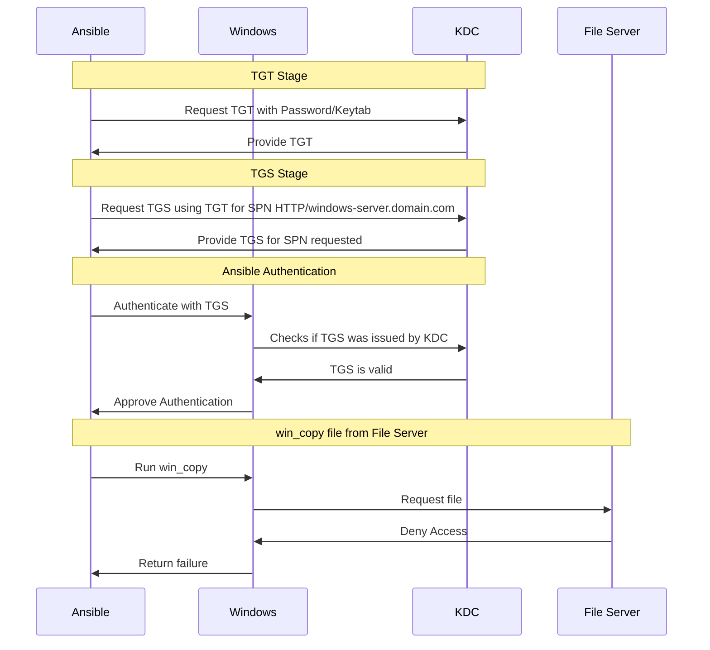
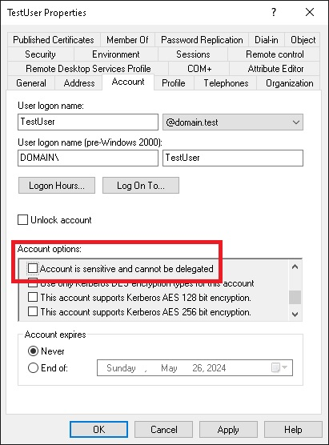
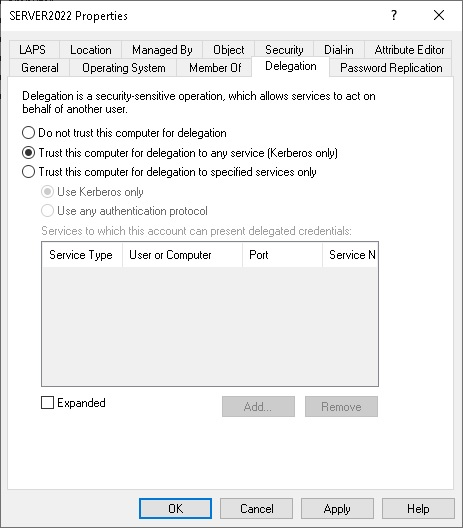

% Kerberos Delegation - Part 1 Unconstrained

This is the start of a 3 part blog series that talks about Kerberos delegation and how it can be used to overcome the credential delegation problem when being used with Ansible.

Kerberos delegation comes in three different forms:

+ Unconstrained
+ Constrained
+ Resource Based Constrained

This post will focus on the unconstrained variant and how it can be used with all three of the common connection plugins used to connect to Windows; [winrm](https://docs.ansible.com/ansible/latest/collections/ansible/builtin/winrm_connection.html), [psrp](https://docs.ansible.com/ansible/latest/collections/ansible/builtin/psrp_connection.html), and [ssh](https://docs.ansible.com/ansible/latest/collections/ansible/builtin/ssh_connection.html).

It is important to understand that unconstrained delegation can be dangerous and should only be used if the risks it exposes are understood.
These risks are outlined later in this post but to sum up the problem unconstrained delegation can allow compromised servers to do anything they want as the connection user rather than what Ansible is trying to do.

# Background
Before going into each delegation type we should go over the basic workflow of Kerberos authentication.
There are a few Kerberos acronyms used in this post that are important to cover:

|Abbreviation|Term|Purpose|
|-|-|-|
|KDC|Key Distribution Center|The domain controller trusted by both the client and server|
|TGT|Ticket Granting Ticket|Ticket given to the client that can be used to request a TGS|
|TGS|Ticket Granting Service|Ticket that can be given to a service to prove the client's identity|
|SPN|Service Principal Name|Name the represents a target service, e.g. `HTTP/windows-server.domain.com`|

When using Kerberos authentication in Ansible there are three entities that are involved:

+ Ansible
+ Windows - The Windows server that Ansible is connecting to
+ KDC - The Domain Controller trusted by both Ansible and Windows

During the Kerberos authentication process there are two main stages; getting the Ticket Granting Ticket (TGT) from a password or keytab, then using the TGT to get a service ticket for authentication.
A simplified workflow for Kerberos authentication as well as a simple delegation scenario with a File Server is as follows:



If we retrieved the TGT ourselves using `kinit` rather than providing the explicit username/password to Ansible, Ansible will only be involved from the TGS Stage onwards.

The TGS Ansible provides to the Windows server is scoped specifically to that Windows server.
This means that the Windows server cannot reuse that ticket when attempting to re-authenticate the connection user to the File server during the `win_copy` process.

What unconstrained delegation solves is to provide a way for the Windows server to re-authenticate as the connection user for any required outbound authentication attempts it needs to do.

Unconstrained delegation uses a similar workflow but will now request a forwardable TGT and embed that TGT inside the TGS for the Windows server to reuse.
This means that the Windows server has enough information to request further tickets for the connection user to authenticate with any service it wants.

It is important that we understand the implications of using unconstrained Kerberos delegation before using it in Ansible.
The biggest risk of using unconstrained delegation is that the TGT embedded inside the TGS provided to the server is cached for future operations.
This means that if the Windows server is compromised either before or after Ansible sends the TGS, the malicious actor is able to extract that TGT themselves and reuse it for anything they wish to do.
There is no way the client can configure the forwarded TGT to say it can only be used to talk to specific services.

# How to Setup
There are three places that may need to be configured to get unconstrained delegation to work in Ansible:

+ The domain controller to allow delegation for the user and/or server
+ The connection plugin, or what is retrieving the TGT, to request a forwardable TGT
+ The connection plugin to request delegation

It is also important that the host we are delegating to can also be done through Kerberos authentication.
This means we will need to avoid IP addresses when trying to access the file server as Kerberos relies on hostnames to work properly.

## Domain Configuration
The first step for configuring unconstrained delegation is to ensure both the username and server allows delegation.
A user can use Kerberos delegation if it is not a member of the `Protected Users` group and is not marked as `Account is sensitive and cannot be delegated`.



Changing the group membership or the user account control setting is applied instantly.
We can use the following PowerShell function to check if a domain username can be used for delegation:

```powershell
Function Test-IsDelegatable {
    [CmdletBinding()]
    param (
        [Parameter(Mandatory)]
        [string]
        $UserName
    )

    $NOT_DELEGATED = 0x00100000

    $searcher = [ADSISearcher]"(&(objectClass=user)(objectCategory=person)(sAMAccountName=$UserName))"
    $res = $searcher.FindOne()
    if (-not $res) {
        Write-Error -Message "Failed to find user '$UserName'"
    }
    else {
        $uac = $res.Properties.useraccountcontrol[0]
        $memberOf = @($res.Properties.memberof)

        $isSensitive = [bool]($uac -band $NOT_DELEGATED)
        $isProtectedUser = [bool]($memberOf -like 'CN=Protected Users,*').Count

        -not ($isSensitive -or $isProtectedUser)
    }
}
```

One we know a user can be delegated we also need to check if the service is allowed to delegate the TGT.
Depending on the version of the Kerberos libraries installed and the `krb5.conf` on the Ansible host this may or may not be required.
If the `/etc/krb5.conf` file contains `enforce_ok_as_delegate = true` then the service must explicitly allow delegation.
If this is unset or set to `false` then the following service configuration is not required to use Kerberos delegation as the Kerberos library will ignore the trusted for delegation flag.

To configure a service to allow unconstrained delegation when the client has `enforce_ok_as_delegate = true` it must set the `Trust this computer for delegation to any service (Kerberos only)` flag.



This is set on the computer account Ansible to connecting to, for example in the above screenshot Ansible is connecting to `SERVER2022`.

We can also use the [microsoft.ad.computer module](https://docs.ansible.com/ansible/latest/collections/microsoft/ad/computer_module.html) to configure this setting through Ansible:

```yaml
- name: Allow server to use unconstrained delegation
  microsoft.ad.computer:
    identity: SERVER2022
    state: present
    trusted_for_delegation: true
```

We can also use PowerShell to set this outside of Ansible through the [Set-ADComputer cmdlet](https://learn.microsoft.com/en-us/powershell/module/activedirectory/set-adcomputer?view=windowsserver2022-ps):

```powershell
Set-ADComputer -Identity SERVER2022 -TrustedForDelegation $true
```

Just like configuring the user, the server delegation settings are applied instantly and requires no reboot before Ansible requests a ticket.

## Forwardable TGT
The next step for configuring unconstrained delegation is to request a forwardable TGT.
This stage is optional as some connection plugins, like `winrm` and `psrp`, will automatically retrieve the TGT when an explicit username and password are provided.
Other connection plugins, like `ssh`, require us to retrieve the TGT outside of Ansible using a program like `kinit`.

When using the `kinit` program can be used to retrieve the TGT, the `-f` argument needs to be added to request a forwardable ticket.

```bash
kinit -f username@DOMAIN.TEST
```

To see what flags a TGT has been retrieved with, we can use the command `klist -f` and view the flags of the `krbtgt/*` ticket:

```bash
klist -f

Ticket cache: FILE:/tmp/krb5cc_1000
Default principal: username@DOMAIN.TEST

Valid starting     Expires            Service principal
22/04/24 23:47:47  23/04/24 09:47:47  krbtgt/DOMAIN.TEST@DOMAIN.TEST
        renew until 23/04/24 23:47:44, Flags: FRIA
```

If the `krbtgt` ticket has the `F` flag present then the ticket is forwardable and can be used for unconstrained delegation.
Do not confuse this with the lowercase `f` flag which represents that the ticket was forwarded, not that it is forwardable.
If the ticket does not have the `F` flag then the user cannot be used for unconstrained delegation, see [Domain Configuration](#domain-configuration) for more information.
Even if we are using the `winrm` or `psrp` connection plugin to manage the TGT, using `kinit -f` is a useful test to ensure that the user being used can request a forwardable ticket.

## Connection Plugin
The final step is to configure the connection plugin to request delegation when connecting to a Windows server.
For the `winrm` and `psrp` connection plugins we just need to set `ansible_winrm_kerberos_delegation=True` or `ansible_psrp_negotiate_delegate=True` respectively.
Doing so will have the connection plugin request a forwardable TGT and also request the delegated ticket in the TGS.
The `ssh` connection plugin is more complex as both the client and server needs to be configured to allow `GSSAPIAuthentication`.

For SSH with Kerberos authentication to work we need to:

+ Configure the server's `sshd_config` to have the line `GSSAPIAuthentication yes`
+ Retrieve the forwardable Kerberos TGT with `kinit -f username@DOMAIN.TEST` before running Ansible
+ Set `ansible_user=username@DOMAIN.TEST` in the host inventory
+ Set the SSH options `GSSAPIAuthentication yes` and `GSSAPIDelegateCredentials yes`.

Setting SSH client options can be configured as part of the arguments provided to Ansible through [ssh_extra_args](https://docs.ansible.com/ansible/latest/collections/ansible/builtin/ssh_connection.html#parameter-ssh_extra_args) or as part of the `~/.ssh/config` file.
For example we can have an inventory that sets the domain username and the extra arguments through the `ansible_ssh_extra_args` variable:

```ini
[windows]
win  ansible_host=win-host.domain.test

[windows:vars]
ansible_user=TestUser@DOMAIN.TEST
ansible_connection=ssh
ansible_shell_type=powershell
ansible_ssh_extra_args=-o GSSAPIAuthentication=yes -o GSSAPIDelegateCredentials=yes
```

It is also possible to configure the GSSAPI settings through the `~/.ssh/config` for the current user.

```
Host *.domain.test
    GSSAPIAuthentication yes
    GSSAPIDelegateCredentials yes
```

The above configuration will apply `GSSAPIAuthentication yes GSSAPIDelegateCredentials yes` for any host that matches `*.domain.test`.

Once everything is configured we can now see delegation in action:

```bash
$ ansible WIN-HOST -m win_shell -a 'Get-Item \\fs\share\test.txt'

WIN-HOST | CHANGED | rc=0 >>

    Directory: \\fs\share\test.txt

Mode                 LastWriteTime         Length Name
----                 -------------         ------ ----
-a----         4/26/2024  10:23 AM             22 test.txt
```

A quick way to test whether the Windows server can delegate the ticket is to run `- win_command: klist.exe` and look at the ticket server and flags.
When delegation is not available the output will be:

```
$ ansible WIN-HOST -m win_command -a 'klist.exe'

WIN-HOST | CHANGED | rc=0 >>

Current LogonId is 0:0x605250

Cached Tickets: (1)

#0>     Client: TestUser @ DOMAIN.TEST
        Server: HTTP/win-host.domain.test @ DOMAIN.TEST
        KerbTicket Encryption Type: AES-256-CTS-HMAC-SHA1-96
        Ticket Flags 0xa10000 -> renewable pre_authent name_canonicalize
        Start Time: 4/26/2024 14:19:42 (local)
        End Time:   4/27/2024 0:19:42 (local)
        Renew Time: 0
        Session Key Type: AES-256-CTS-HMAC-SHA1-96
        Cache Flags: 0x8 -> ASC
        Kdc Called:
```

When delegation is available the output will be:

```
$ ansible WIN-HOST -m win_command -a 'klist.exe'

WIN-HOST | CHANGED | rc=0 >>

Current LogonId is 0:0x60a760

Cached Tickets: (1)

#0>     Client: TestUser @ DOMAIN.TEST
        Server: krbtgt/DOMAIN.TEST @ DOMAIN.TEST
        KerbTicket Encryption Type: AES-256-CTS-HMAC-SHA1-96
        Ticket Flags 0x60a10000 -> forwardable forwarded renewable pre_authent name_canonicalize
        Start Time: 4/26/2024 14:19:47 (local)
        End Time:   4/27/2024 0:19:47 (local)
        Renew Time: 4/27/2024 14:19:47 (local)
        Session Key Type: AES-256-CTS-HMAC-SHA1-96
        Cache Flags: 0x1 -> PRIMARY
        Kdc Called:
```

When delegation is available the ticket server will be `krbtgt/*` and `forwardable` will be in the ticket flags.

# Summary
With this post we should now have a better understanding of Kerberos authentication and how unconstrained delegation can be used with Ansible.
It is important that we only use unconstrained delegation when we trust the target Windows host to impersonate our user account and that the user we are using is not sensitive where delegation could cause further damage if the server was compromised.

Stay tuned for future posts which will explore other delegation types like constrained and resource based delegation that can mitigate some of the dangers of unconstrained delegation.
