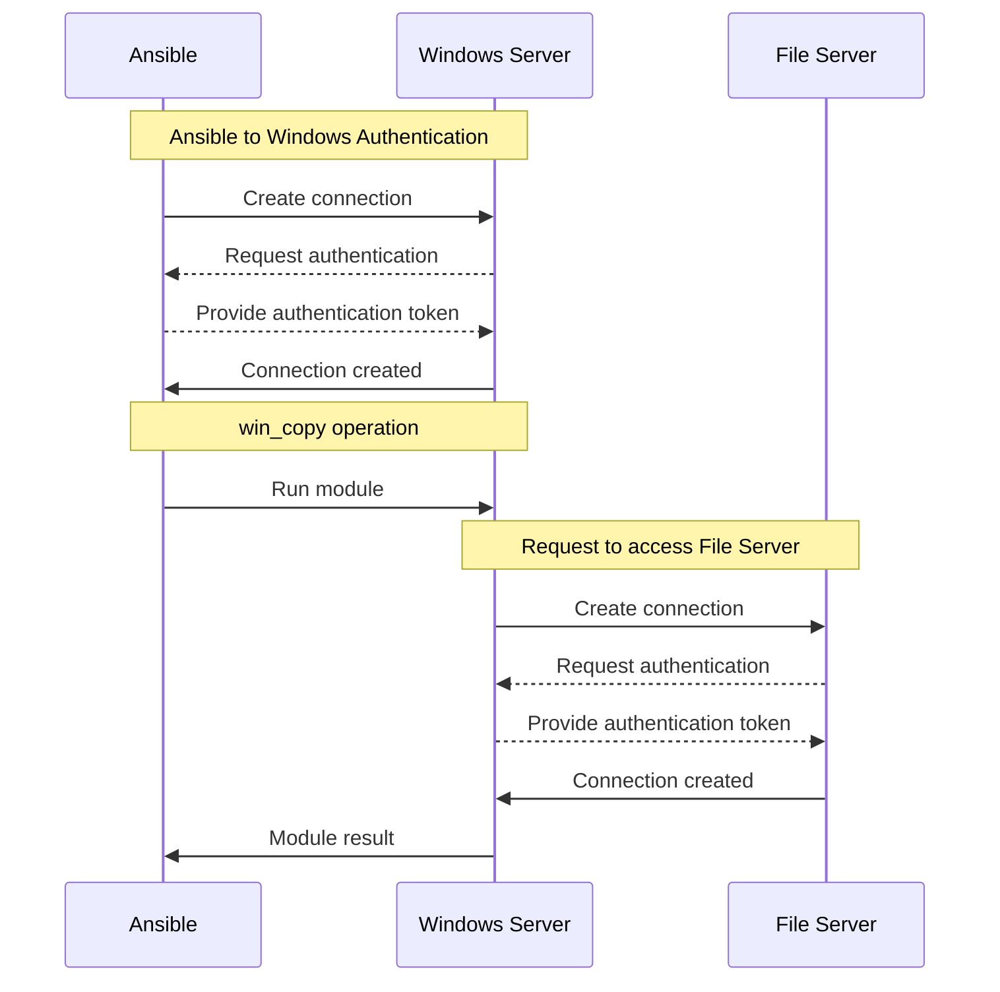

# Making the Double Hop
One very common use case with Windows is to access a file from a network location.
When trying to do a similar action interactively things typically just work but trying to do the same thing in Ansible will typically fail.

A specific example in Ansible would be trying to copy a file from a UNC path to a local directory using [ansible.windows.win_copy](https://docs.ansible.com/ansible/latest/collections/ansible/windows/win_copy_module.html):

```yaml
- name: Copy application config file
  win_copy:
    src: \\fs\share\app\app.config
    dest: C:\app\app.config
    remote_src: true
```

Errors with:

```yaml
fatal: [win-host]: FAILED! =>
    changed: false
    dest: C:\app\app.config
    msg: 'Unhandled exception while executing module: Access is denied'
    src: \\fs\share\app\app.config
```

The culprit behind this problem is something called credential delegation and is also known as the double hop problem.
This post will try to explain the reason why this fails and ways you can get it working.

## Windows Authentication
To understand this problem you first need to understand how authentication works in Windows. A basic workflow of the `win_copy` example from above is:



When Ansible authenticates with a remote Windows host it typically uses an authentication protocol like Kerberos, NTLM, CredSSP, among others.
These protocols typically rely on proving to the Windows server that we know a secret only that user can know, for example a Kerberos ticket derived from their password, or the SSH private key pair.
Some protocols provide enough information to the server that allows it to generate new tokens for subsequent authentication attempts whereas others do not.
If the logon session does not have this information it cannot then re-authenticate itself with the File Server resulting in an `Access is denied` error message.

It cannot re-use the token provided by Ansible for the initial authentication because that is scoped just for Ansible to authenticate with Windows Server.
That means to overcome this problem we have to provide enough information for Windows Server to be able to re-authenticate the connection user with File Server.
Here are a few possible solutions to this problem when using Ansible:

+ Using [become](https://docs.ansible.com/ansible/latest/playbook_guide/playbooks_privilege_escalation.html) on the task
+ Using a connection authentication protocol that supports delegation
+ Providing explicit credentials if the module/script supports it

## Become
The simplest solution to this problem is to use Ansible's [become](https://docs.ansible.com/ansible/latest/playbook_guide/playbooks_privilege_escalation.html) implementation as it requires no changes to the connection used to the initial Windows target.
For Windows we can use the [ansible.builtin.runas](https://docs.ansible.com/ansible/latest/collections/ansible/builtin/runas_become.html) become plugin that can be used to run the module task either as a different user or to provide explicit credentials for delegation.
Using our `win_copy` example here is how we can use `runas` to set credentials for delegation:

```yaml
- name: Copy application config file
  win_copy:
    src: \\fs\share\app\app.config
    dest: C:\app\app.config
    remote_src: true
  become: true
  become_method: runas
  become_flags: logon_type=new_credentials logon_flags=netcredentials_only
  vars:
    ansible_become_user: '{{ ansible_user }}'
    ansible_become_pass: '{{ ansible_password }}'
```

Breaking down the above we can see the following task directives have been added.

```yaml
become: true
```

This enables become on this specific task.

```yaml
become_method: runas
```

This sets the become plugin that is run for this task to be the `runas` plugin.
This plugin is specifically designed for Windows hosts.
It can also be set through the `ansible_become_method` variable on the host/group vars simplifying the task definition.

```yaml
become_flags: logon_type=new_credentials logon_flags=netcredentials_only
```

These are special flags for `runas` which tells it to only use the become credentials specified for any outbound authentication attempts, like accessing the file server specified.
The default behaviour without these flags would be to run the whole module process as the user specified which may be undesirable if the credentials provided is not a valid Windows user.

```yaml
vars:
  ansible_become_user: '{{ ansible_user }}'
  ansible_become_pass: '{{ ansible_password }}'
```

Provides the explicit username and password for the become plugin.
These will be the credentials used to authenticate with the target file server `fs` in this example.
This example will just reuse the same credentials used for the connection to the Windows Server but it can be anything else specific to your environment.

## Connection-based Delegation
Another solution is to change the authentication protocol used in the connection to one that supports credential delegation.
As this is specific to the connection plugin used there is no one protocol that can always be used.
For example the builtin connection plugins that work with Windows can be used with the following authentication protocols for credential delegation:

|Protocol|Connection Plugin|
|-|-|
|CredSSP|`winrm`, `psrp`|
|Plaintext Password|`ssh`|
|Kerberos|`winrm`, `psrp`, `ssh`|

The CredSSP and SSH plaintext password authentication protocols work by providing the explicit username and password during the authentication process.
This means the logon session created on the Windows Server is able to re-authenticate using those credentials provided.
In delegation terms this is called unconstrained delegation as it allows the server to authenticate with any target it wishes.

The Kerberos protocol also provides support for unconstrained delegation but it can also be configured for constrained delegation which allows you to restrict what hosts the server can delegate to.
Constrained delegation is ideal as it restricts how the server can re-use the user's identity but it requires extra configuration on the Active Directory environment to work.
How to use Kerberos delegation is a complex topic in itself and will be the focus on a future blog post.

## Context Specific Credentials
The final option available to Ansible for making the double hop is to provide credentials as part of a module specific option.
For example the [microsoft.ad.user](https://docs.ansible.com/ansible/latest/collections/microsoft/ad/user_module.html) module has a `domain_username` and `domain_password` option that can be used to authenticate as that user for AD operations.

```yaml
- name: Create domain user
  microsoft.ad.user:
    name: MyUser
    state: present
    password: '{{ user_password }}'
    domain_username: '{{ ad_username }}'
    domain_password: '{{ ad_password }}'
```

In the above example, the `microsoft.ad.user` module will authenticate with the username/password specified by the `ad_username` and `ad_password` variables respectively.
Being able to provide a credential in this manner is dependent on the module that is being used.
In the case of running custom PowerShell code through [ansible.builtin.script](https://docs.ansible.com/ansible/latest/collections/ansible/builtin/script_module.html), [ansible.windows.win_powershell](https://docs.ansible.com/ansible/latest/collections/ansible/windows/win_powershell_module.html#ansible-collections-ansible-windows-win-powershell-module), or [ansible.windows.win_shell](https://docs.ansible.com/ansible/latest/collections/ansible/windows/win_shell_module.html#ansible-collections-ansible-windows-win-shell-module) it requires the cmdlet being used to expose the functionality through a parameter like `-Credential`.

It is important in the above examples that the task is run with `no_log: true` to ensure the credentials are not persisted in any logging mechanism accidentally:

```yaml
- name: Run win_powershell example with explicit credentials
  ansible.windows.win_powershell:
    script: |
      param($UserName, $Password)

      $cred = [PSCredential]::new($UserName, (ConvertTo-SecureString -AsPlainText -Force $Password))
      Get-CmdletExample -Credential $cred
    parameters:
      UserName: MyUser
      Password: '{{ script_password }}'
  no_log: true
```
