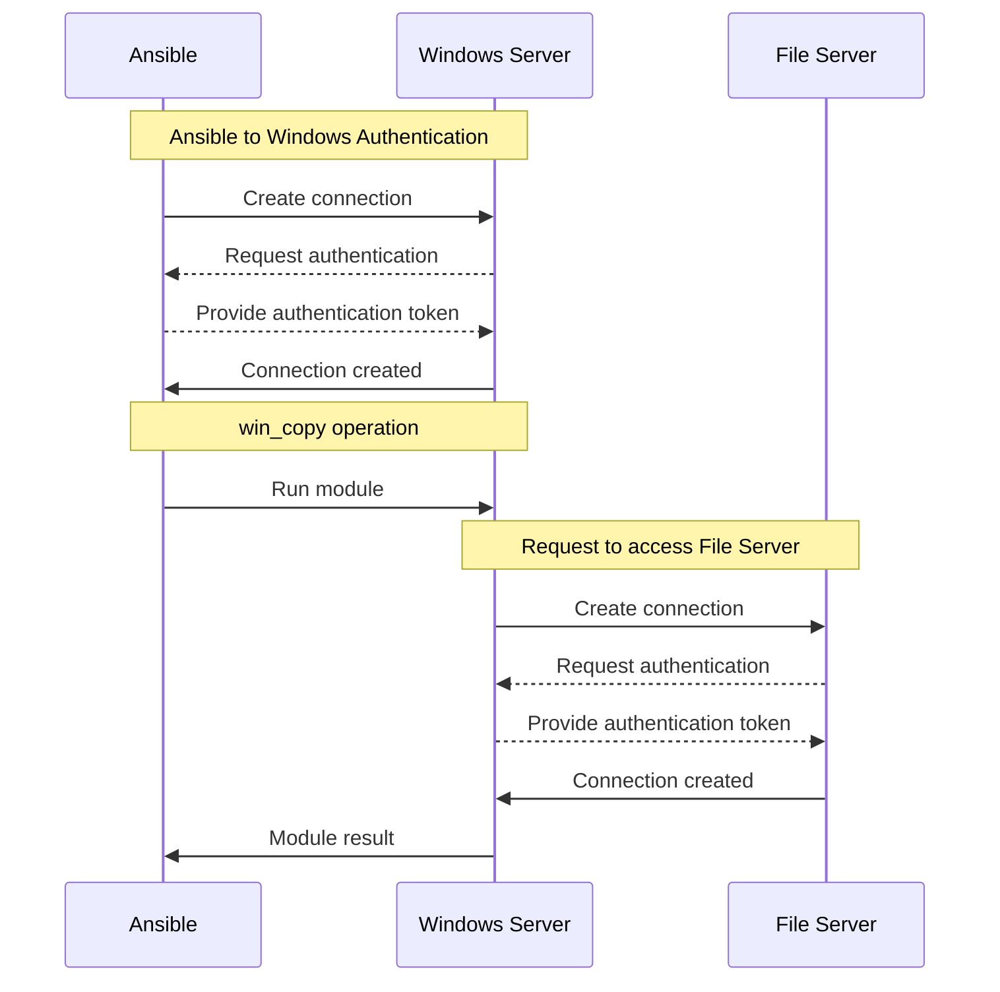

% Making the Double Hop

One very common use case with Windows is trying to access a file from a network location, for example installing a project from a network path, or copying application settings from a central file share.
When trying to do a similar action when logged on interactively things typically just work but trying to do the same thing in Ansible might fail.

A specific example in Ansible would be trying to copy a file from a UNC path to a local directory using [ansible.windows.win_copy](https://docs.ansible.com/ansible/latest/collections/ansible/windows/win_copy_module.html):

```yaml
- name: Copy application config file
  win_copy:
    src: \\fs\share\app\app.config
    dest: C:\app\app.config
    remote_src: true
```

Running the above example would fail with:

```yaml
fatal: [win-host]: FAILED! =>
    changed: false
    dest: C:\app\app.config
    msg: 'Unhandled exception while executing module: Access is denied'
    src: \\fs\share\app\app.config
```

The culprit behind this problem is something called credential delegation and is also known as the double hop problem.
This post will try to explain the reason why this fails and ways we can get it working.

# Windows Authentication
To understand this problem we first need to understand how authentication works in Windows.
A basic workflow of the `win_copy` example from above is:



When Ansible authenticates with a remote Windows host it typically uses an authentication protocol like Kerberos, NTLM, CredSSP, among others.
These protocols typically rely on proving to the Windows server that we know a secret only the user can know, for example a Kerberos ticket derived from their password, or the SSH private key pair.
Some protocols provide enough information to the server that allows it to generate new tokens for subsequent authentication attempts whereas others do not.
If the logon session does not have this information it cannot then re-authenticate itself with the File Server resulting in an `Access is denied` error message.

The Windows server cannot re-use the token provided by Ansible because that is scoped just for Ansible to authenticate with Windows Server.
That means to overcome this problem we have to provide enough information for the Windows server to be able to re-authenticate the user with File Server.
With Ansible we have a few possible solutions to this problem:

+ Using [become](https://docs.ansible.com/ansible/latest/playbook_guide/playbooks_privilege_escalation.html) on the task
+ Using a connection authentication protocol that supports delegation
+ Providing explicit credentials if the module/script supports it

# Become
The simplest solution to this problem is to use Ansible's [become](https://docs.ansible.com/ansible/latest/playbook_guide/playbooks_privilege_escalation.html) implementation as it requires no changes to the connection used by Ansible.
For Windows we can use the [ansible.builtin.runas](https://docs.ansible.com/ansible/latest/collections/ansible/builtin/runas_become.html) become plugin that will run the module task either as a different user or with explicit credentials used for outbound authentication.
Using our `win_copy` example here is how we can use `runas` to set credentials for delegation:

```yaml
- name: Copy application config file
  win_copy:
    src: \\fs\share\app\app.config
    dest: C:\app\app.config
    remote_src: true
  become: true
  become_method: runas
  become_flags: logon_type=new_credentials logon_flags=netcredentials_only
  vars:
    ansible_become_user: '{{ ansible_user }}'
    ansible_become_pass: '{{ ansible_password }}'
```

Breaking down the above example we can see the following task directives have been added.

```yaml
become: true
```

This enables become on this specific task.

```yaml
become_method: runas
```

This sets the become plugin that is run for this task to be the `runas` plugin.
The `runas` plugin is specifically designed to work with Windows hosts.
The become plugin used can also be set through the `ansible_become_method` variable on the host/group vars simplifying the task definition.

```yaml
become_flags: logon_type=new_credentials logon_flags=netcredentials_only
```

These are special flags for `runas` which tells it to only use the credentials specified for any outbound authentication attempts, for example when accessing a file server.
The default behavior without these flags would be to run the whole module process as the user specified.
For just solving the double hop problem we only need it for outbound authentication so the become flags limit the scope in which the credentials are used.

```yaml
vars:
  ansible_become_user: '{{ ansible_user }}'
  ansible_become_pass: '{{ ansible_password }}'
```

Provides the explicit username and password for the become plugin through specific variables on that task.
These will be the credentials used to authenticate with the target file server `fs` in this example.
The username and password can be set to any value that is relevant for our environment, in this case we are just re-using the same connection variables to solve the double hop problem.

It is important that the Windows host Ansible is connecting to is trusted to handle the become credentials as it is a form of unconstrained delegation.
If the Windows host is compromised it could theoretically re-use the credentials provided and pretend to be that user for other tasks.
To avoid this problem, we will need to use a form of constrained delegation through a connection based solution.

# Connection-based Delegation
It is possible to solve the double hop problem by using features that are part of the connection plugin Ansible uses.
As these features are specific to the connection plugin there is no one option available in all cases.
For example the builtin connection plugins that work with Windows can be used with the following authentication protocols for credential delegation:

|Protocol|Connection Plugin|Delegation Type|
|-|-|-|
|CredSSP|`winrm`, `psrp`|Unconstrained|
|Plaintext Password|`ssh`|Unconstrained|
|Kerberos|`winrm`, `psrp`, `ssh`|Unconstrained and Constrained|

The CredSSP and SSH plaintext password authentication protocols solve the problem in a similar way to how `become` works by sending the explicit username and password to the Windows server.
In delegation terms this is called unconstrained delegation as it allows the server to authenticate with any target it wishes using those credentials.

The Kerberos protocol also has a way to achieve unconstrained delegation but it can also be used with constrained delegation.
Constrained delegation is ideal as it restricts how the server can re-use the user's identity but it requires extra configuration in the Active Directory environment before it can work.
How to use Kerberos delegation is a complex topic in itself and will be the focus of a future blog post.

# Context Specific Credentials
The final option available to Ansible for solving the double hop problem is to provide credentials as part of a module specific option.
For example the [microsoft.ad.user](https://docs.ansible.com/ansible/latest/collections/microsoft/ad/user_module.html) module has a `domain_username` and `domain_password` option that can be used to authenticate to the Active Directory server with specific credentials.

```yaml
- name: Create domain user
  microsoft.ad.user:
    name: MyUser
    state: present
    password: '{{ user_password }}'
    domain_username: '{{ ad_username }}'
    domain_password: '{{ ad_password }}'
```

In the above example, the `microsoft.ad.user` module will authenticate with the username/password specified by the `ad_username` and `ad_password` variables respectively.
Being able to provide a credential in this manner is dependent on the module that is being used and whether it exposes such an option.
In the case of running custom PowerShell code through [ansible.builtin.script](https://docs.ansible.com/ansible/latest/collections/ansible/builtin/script_module.html), [ansible.windows.win_powershell](https://docs.ansible.com/ansible/latest/collections/ansible/windows/win_powershell_module.html#ansible-collections-ansible-windows-win-powershell-module), or [ansible.windows.win_shell](https://docs.ansible.com/ansible/latest/collections/ansible/windows/win_shell_module.html#ansible-collections-ansible-windows-win-shell-module) it requires the cmdlet being used to expose the functionality through a parameter like `-Credential`.

It is important in the above examples that the task is run with `no_log: true` to ensure the credentials are not persisted in any logging mechanism accidentally:

```yaml
- name: Run win_powershell example with explicit credentials
  ansible.windows.win_powershell:
    script: |
      param($UserName, $Password)

      $cred = [PSCredential]::new($UserName, (ConvertTo-SecureString -AsPlainText -Force $Password))
      Get-CmdletExample -Credential $cred
    parameters:
      UserName: MyUser
      Password: '{{ script_password }}'
  no_log: true
```

# Next Steps
With all this information we should now be able to identify when a double hop problem can occur as well as how to workaround the issue.
By using `become`, connection authentication settings, or utilizing existing available module options we easily workaround this issue and write tasks that work in the same way that it does when running it interactively.
